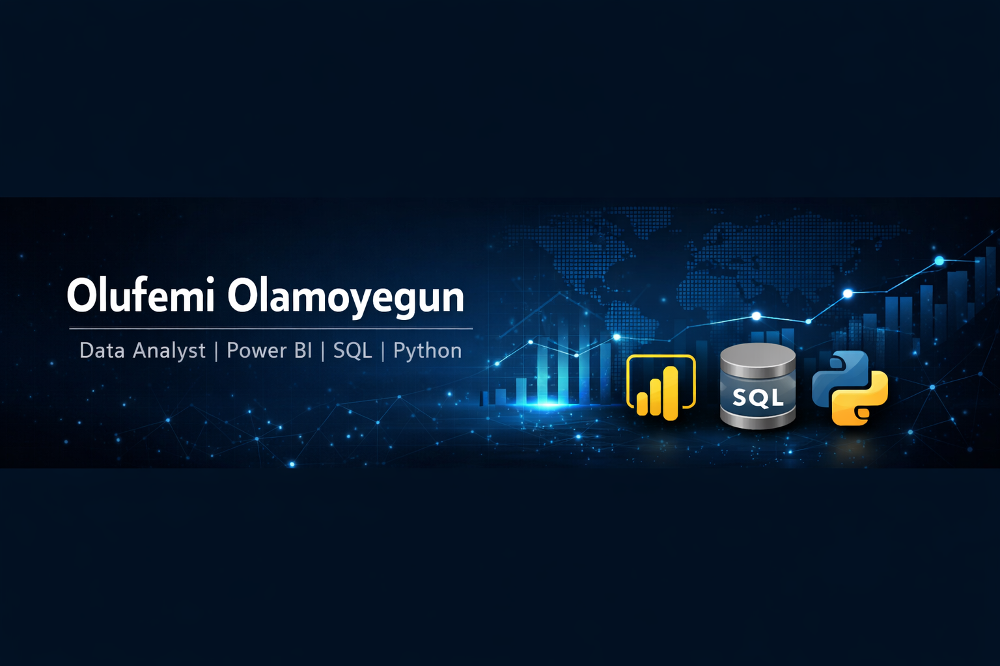

  

<h1 align="center">Olufemi Olamoyegun</h1>
<h3 align="center">Data Analyst | Power BI | SQL | Python | Microsoft Fabric</h3>

  Turning complex data into actionable business insights.

  <a href="mailto:olamoyegun07@gmail.com">Email</a> •
  <a href="https://www.linkedin.com/in/olufemi-olamoyegun">LinkedIn</a> •
  <a href="https://olufemiolamoyegun.github.io/">Portfolio</a>

---

## 🚀 About Me

I am a Data Analyst focused on transforming raw data into strategic insights through dashboards, SQL analysis, and Python-driven analytics.

I specialize in:

- 📊 Business Intelligence & Dashboard Development  
- 🧠 KPI Design & Performance Tracking  
- 🗄 SQL & Data Modeling  
- 🐍 Python Analytics (Pandas, NumPy, Statsmodels)  
- 🔄 Reporting Automation & ETL Pipelines  
- 📈 Data Storytelling for Decision Support  

---

## 📂 Featured Projects

### 🔹 PwC Call Centre Analytics Dashboard
Power BI dashboard analyzing customer satisfaction, agent productivity, and service demand trends.

**Tools:** Power BI, Power Query, Excel  
**Impact:** Improved performance visibility and reduced service bottlenecks.

---

### 🔹 HR Analytics & Workforce Intelligence
Enterprise HR analytics solution measuring attrition and engagement using SQL & Power BI.

**Tools:** SQL, Power BI, Data Modeling  
**Impact:** Identified high-risk attrition segments for targeted intervention.

---

### 🔹 A/B Testing & Growth Analytics
Python-based statistical testing to evaluate product variant performance.

**Tools:** Python, Pandas, NumPy, Statsmodels  
**Impact:** Data-backed rollout decision with measurable revenue lift.

---

### 🔹 Spotify Streaming Analytics
Exploratory analysis uncovering drivers of streaming engagement.

**Tools:** Python, Matplotlib, Seaborn  
**Impact:** Identified energy/danceability as key stream drivers.

---

## 🛠 Technical Stack

### Business Intelligence
Power BI • Microsoft Fabric • DAX • Power Query

### Data Analysis
SQL • Python • Pandas • NumPy • Statsmodels • Excel

### Data Engineering
ETL Pipelines • Data Cleaning • Data Validation • KPI Modeling

---

## 📜 Certifications

- Microsoft Certified: Power BI Data Analyst Associate  
- Microsoft Certified: Fabric Analytics Engineer Associate  
- Business Intelligence & Data Analyst (BIDA™) – CFI  
- Data Analyst in Power BI – DataCamp  

---

## 📊 GitHub Analytics

  

  

---

## 🤝 Let’s Connect

I’m open to Data Analyst, BI, and Analytics roles.

📧 olamoyegun07@gmail.com  
🔗 https://www.linkedin.com/in/olufemi-olamoyegun  
💻 https://olufemiolamoyegun.github.io/
