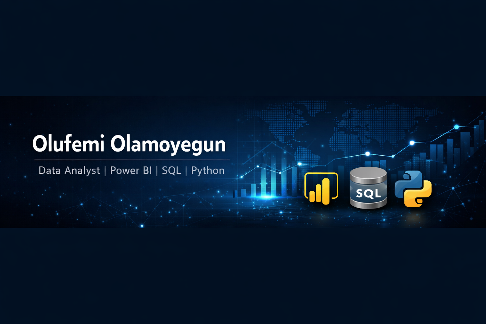
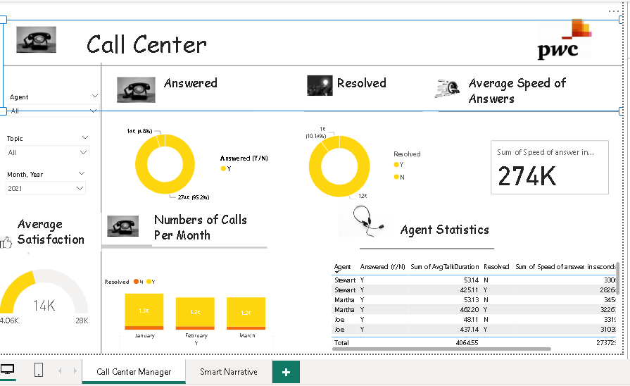
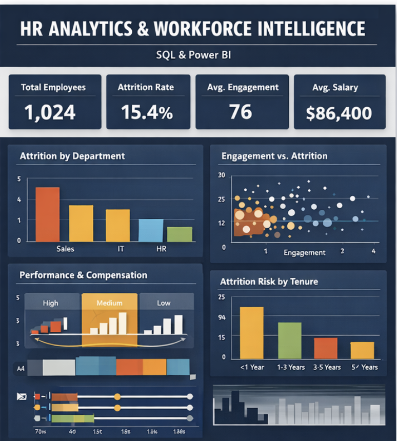
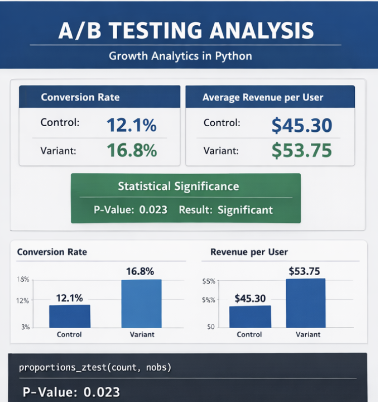
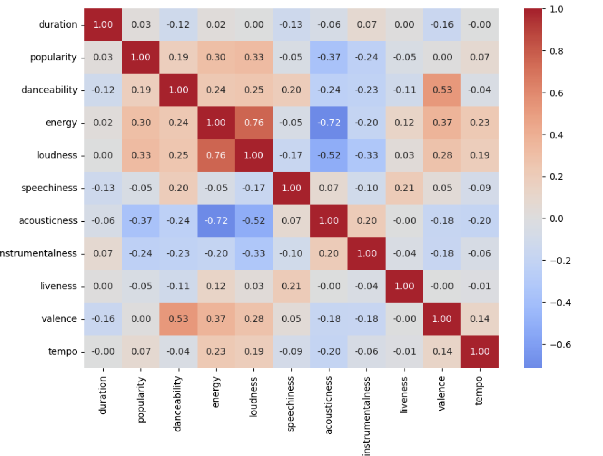

  

<h1 align="center">Olufemi Olamoyegun</h1>
<h3 align="center">Olufemi Olamoyegun
Data Analyst | Finance & Operational Analytics | Power BI • Fabric • Python • SQL</h3>

  Turning complex data into actionable business insights.

  <a href="mailto:olamoyegun07@gmail.com">Email</a> •
  <a href="https://www.linkedin.com/in/olufemi-olamoyegun">LinkedIn</a> •
  <a href="https://olufemiolamoyegun.github.io/">Portfolio</a> •
  <a href="https://github.com/olufemiolamoyegun">GitHub</a>

---

## 🚀 About Me

Data Analyst with 3+ years of analytics experience and 11 years in finance and operations. Skilled
in transforming complex data into actionable insights using Power BI, SQL, Python, and Microsoft
Fabric. Focused on improving decision-making, efficiency, and business performance.  

Core Skills

Data & Engineering SQL, Python, ETL, Data Modeling
BI & Visualization Power BI, Fabric, Dashboards, DAX
Analytics A/B Testing, Forecasting, Statistics
Tools Excel, Power Automate

---

## 📂 Featured Projects

### 🔹 PwC Call Centre Analytics Dashboard
**Power BI dashboard** analyzing customer satisfaction, agent productivity, and service demand trends.  
**Tools:** Power BI, Power Query, Excel  
**Impact:** Improved performance visibility and reduced service bottlenecks.  

  
🔗 [View Project](https://github.com/olufemiolamoyegun/Project---PWC-Call-Centre-Solution-with-Power-BI)

---

### 🔹 HR Analytics & Workforce Intelligence
Enterprise HR analytics solution measuring **attrition, engagement, and compensation** using SQL & Power BI.  
**Tools:** SQL, Power BI, Data Modeling  
**Impact:** Identified high-risk attrition segments for targeted intervention.  

  
🔗 [View Project](https://github.com/olufemiolamoyegun/-HR-Analytics-Workforce-Intelligence)

---

### 🔹 A/B Testing & Growth Analytics
Python-based **statistical testing** to evaluate product variant performance.  
**Tools:** Python, Pandas, NumPy, Statsmodels  
**Impact:** Data-backed rollout decisions with measurable revenue lift.  

  
🔗 [View Project](https://github.com/olufemiolamoyegun/Growth-Analytics-A-B-Testing)

---

### 🔹 Spotify Streaming Analytics
Exploratory data analysis uncovering **drivers of engagement and track popularity**.  
**Tools:** Python, Matplotlib, Seaborn  
**Impact:** Identified energy/danceability as key stream drivers.  

  
🔗 [View Project](https://github.com/olufemiolamoyegun/-Spotify-Streaming-Analytics-Python-)

---

## 🛠 Technical Stack

### Business Intelligence
Power BI • Microsoft Fabric • DAX • Power Query  

### Data Analysis
SQL • Python • Pandas • NumPy • Statsmodels • Excel  

### Data Engineering
ETL Pipelines • Data Cleaning • Data Validation • KPI Modeling  

---

## Experience
- BI & Analytics Lead – Cadworks Ltd (2024–Present)
- Director, Business Analytics – Cadworks Ltd (2023–2024)
- Finance & Operational Analytics Specialist (2012–2023)

## 📜 Certifications

  
  
  
  

- Microsoft Certified: Power BI Data Analyst Associate  
- Microsoft Certified: Fabric Analytics Engineer Associate  
- Business Intelligence & Data Analyst (BIDA™) – CFI  
- Data Analyst in Power BI – DataCamp  

---

## 📊 GitHub Stats

  
  
  

---

## 🤝 Connect With Me

I’m open to Data Analyst, BI, and Analytics roles.

📧 Email: olamoyegun07@gmail.com  
🔗 LinkedIn: [olufemiolamoyegun](https://www.linkedin.com/in/olufemi-olamoyegun)  
💻 Portfolio: [olufemiolamoyegun.github.io](https://olufemiolamoyegun.github.io/)  
🐙 GitHub: [github.com/olufemiolamoyegun](https://github.com/olufemiolamoyegun)  
✍️ Medium: [medium.com/@olufemiolamoyegun](https://medium.com/@olufemiolamoyegun)  
▶️ YouTube: [youtube.com/@olufemibuilds](https://youtube.com/@olufemibuilds)

✨ *Let’s turn data into smarter business decisions.*
